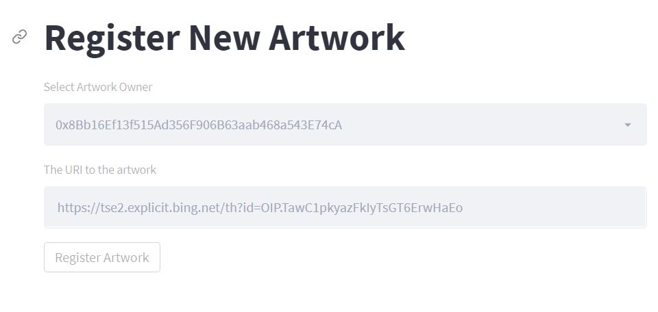
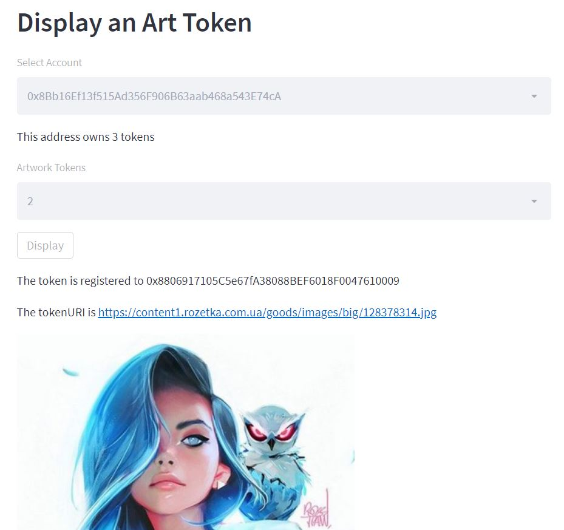

# Simple NFT registration

This is simple dApp to mint and showcase NFTs.

As a frontend uses Streamlit.

# Environment

Pls, provide

```
WEB3_PROVIDER_URI = ""
SMART_CONTRACT_ADDRESS = ""
```

# dAPP screenshots




